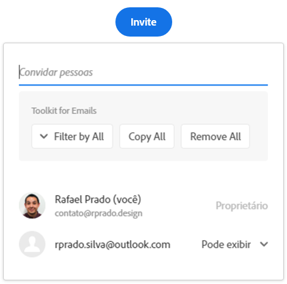

 

    
    <h1>
      Adobe Xd E-tools
    </h1>
    An extension to enable Adobe Xd prototype email tools

 

## About

In a workflow where we used Adobe Xd as the primary way to validate prototypes, a gap was identified when it came to managing guest emails.

**Solution**

Ease email management for adobe xd prototypes through an extension that creates a toolbox.

**Permissions**

The button is only generated when the user has access to invite someone in the prototype, following as access and privileges granted through Adobe Xd.

The author of this extension is free from any malicious use of the source code.

## How to use

1. Install extension [here](https://chrome.google.com/webstore/detail/copy-adobe-xd-e-mails/ecmiahbepkgkfkcbbnklhhfilpljehjn)
2. Enable extension
3. Go to your adobe xd prototype link or refresh your prototype page

## Compatibility

|                  Browser                   | It works |
| :----------------------------------------: | :------: |
|   |    ✅    |
|     |    ✅    |
|  |    ✅    |
|   |    ⛔    |

## Authors

|      [Rafael Prado](http://www.github.com/rpradosilva)      |
| :---------------------------------------------------------: |
|  |

---

### 
